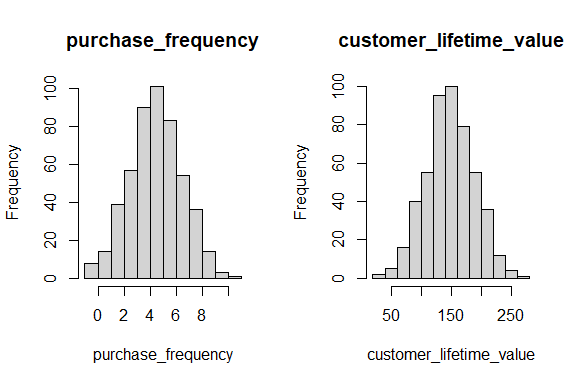
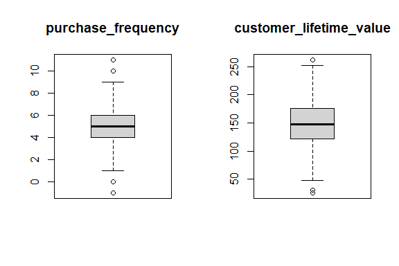
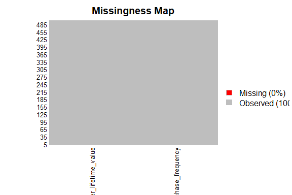
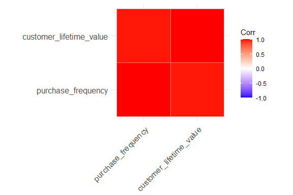
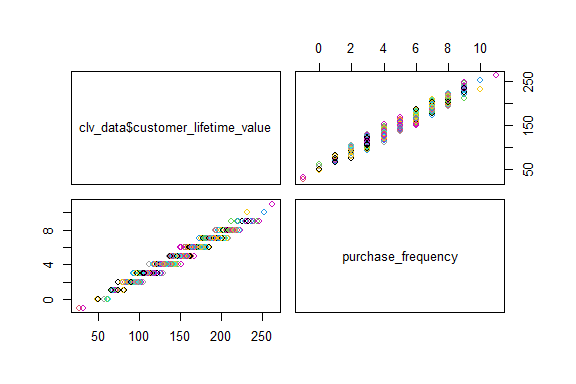
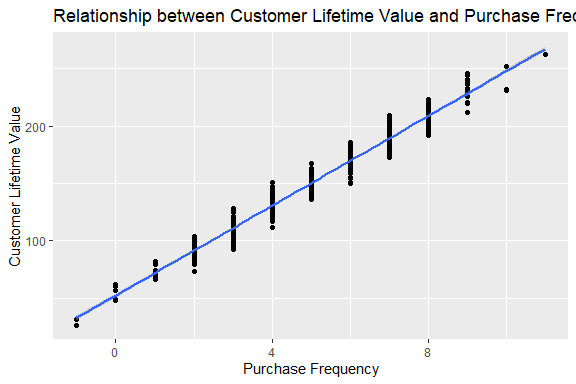
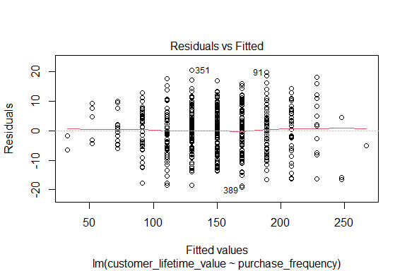
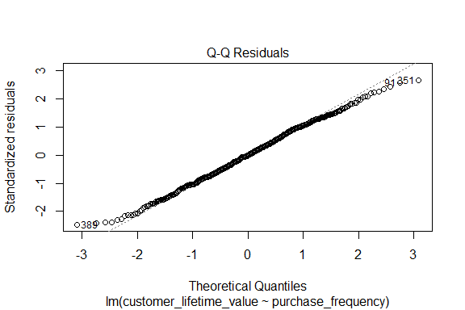
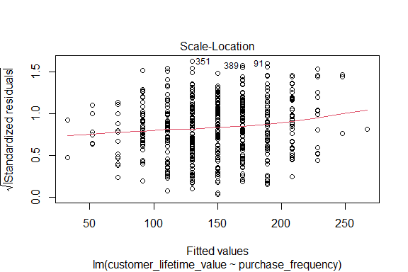

# Load the Dataset

The following synthetic dataset contains the estimated Customer Lifetime Value (CLV) as the dependent variable and the customer purchase frequency as the independent variable. The dataset is loaded as shown below.


``` r
# `pacman::p_load()` is designed to both install and load packages
pacman::p_load("readr")

clv_data <- read_csv("./data/clv_data.csv")
head(clv_data)
```

```
## # A tibble: 6 × 2
##   purchase_frequency customer_lifetime_value
##                <dbl>                   <dbl>
## 1                  3                   110. 
## 2                  7                   190. 
## 3                  6                   160. 
## 4                  2                    94.4
## 5                  4                   133. 
## 6                  8                   223.
```

Display a summary of all the variables.


``` r
summary(clv_data)
```

```
##  purchase_frequency customer_lifetime_value
##  Min.   :-1.000     Min.   : 26.13         
##  1st Qu.: 4.000     1st Qu.:122.04         
##  Median : 5.000     Median :148.21         
##  Mean   : 4.914     Mean   :148.25         
##  3rd Qu.: 6.000     3rd Qu.:175.88         
##  Max.   :11.000     Max.   :262.04
```

# Initial Exploratory Data Analysis (EDA)

[**View the Dimensions**]{.underline}

The number of observations and the number of variables.


``` r
dim(clv_data)
```

```
## [1] 500   2
```

[**View the Data Types**]{.underline}


``` r
sapply(clv_data, class)
```

```
##      purchase_frequency customer_lifetime_value 
##               "numeric"               "numeric"
```


``` r
str(clv_data)
```

```
## spc_tbl_ [500 × 2] (S3: spec_tbl_df/tbl_df/tbl/data.frame)
##  $ purchase_frequency     : num [1:500] 3 7 6 2 4 8 0 4 8 3 ...
##  $ customer_lifetime_value: num [1:500] 110.3 190.2 160 94.4 133.2 ...
##  - attr(*, "spec")=
##   .. cols(
##   ..   purchase_frequency = col_double(),
##   ..   customer_lifetime_value = col_double()
##   .. )
##  - attr(*, "problems")=<externalptr>
```

[**Descriptive Statistics**]{.underline}

Understanding your data can lead to:

-   **Data cleaning:** To remove extreme outliers or impute missing data.

-   **Data transformation:** To reduce skewness

-   **Data modelling:** You may notice properties of the data such as distributions or data types that suggest the use of parametric or non-parametric statistical tests and algorithms

Descriptive statistics can be used to understand your data. Typical descriptive statistics include:

1.  **Measures of frequency:** count and percent

2.  **Measures of central tendency:** mean, median, and mode

3.  **Measures of distribution/dispersion/spread/scatter/variability:** minimum, quartiles, maximum, variance, standard deviation, coefficient of variation, range, interquartile range (IQR) [includes a box and whisker plot for visualization], kurtosis, skewness [includes a histogram for visualization]).

4.  **Measures of relationship:** covariance and correlation

## [**Measures of Frequency**]{.underline}

This is applicable in cases where you have categorical variables, e.g., 60% of the observations are male and 40% are female (2 categories).

## [**Measures of Central Tendency**]{.underline}

The median and the mean of each numeric varible:


``` r
summary(clv_data)
```

```
##  purchase_frequency customer_lifetime_value
##  Min.   :-1.000     Min.   : 26.13         
##  1st Qu.: 4.000     1st Qu.:122.04         
##  Median : 5.000     Median :148.21         
##  Mean   : 4.914     Mean   :148.25         
##  3rd Qu.: 6.000     3rd Qu.:175.88         
##  Max.   :11.000     Max.   :262.04
```

## [**Measures of Distribution**]{.underline}

Measuring the variability in the dataset is important because the amount of variability determines **how well you can generalize** results from the sample to a new observation in the population.

Low variability is ideal because it means that you can better predict information about the population based on the sample data. High variability means that the values are less consistent, thus making it harder to make predictions.

The format `dataset[rows, columns]` can be used to specify the exact rows and columns to be considered. `dataset[, columns]` implies all rows will be considered. Specifying `BostonHousing[, -4]` implies all the columns except column number 4. This can also be stated as `BostonHousing[, c(1,2,3,5,6,7,8,9,10,11,12,13,14)]`. This allows us to calculate the standard deviation of only columns that are numeric, thus leaving out the columns termed as “factors” (categorical) or those that have a string data type.

**Variance:**


``` r
# `sapply()` is designed to apply a function to a variable in a dataset
# In this case, we use `sapply()` to apply the `var()` function used to compute the variance.
sapply(clv_data[,], var)
```

```
##      purchase_frequency customer_lifetime_value 
##                4.146898             1642.315996
```

**Standard deviation:**


``` r
sapply(clv_data[,], sd)
```

```
##      purchase_frequency customer_lifetime_value 
##                2.036393               40.525498
```

**Kurtosis:**

The Kurtosis informs us of how often outliers occur in the results. There are different formulas for calculating kurtosis. Specifying “type = 2” allows us to use the 2nd formula which is the same kurtosis formula used in other statistical software like SPSS and SAS.

In “type = 2” (used in SPSS and SAS):

1.  Kurtosis \< 3 implies a low number of outliers

2.  Kurtosis = 3 implies a medium number of outliers

3.  Kurtosis \> 3 implies a high number of outliers


``` r
pacman::p_load("e1071")
sapply(clv_data[,],  kurtosis, type = 2)
```

```
##      purchase_frequency customer_lifetime_value 
##              -0.1220038              -0.1484811
```

**Skewness:**

The skewness is used to identify the asymmetry of the distribution of results. Similar to kurtosis, there are several ways of computing the skewness.

Using “type = 2” (common in other statistical software like SPSS and SAS) can be interpreted as:

1.  Skewness between -0.4 and 0.4 (inclusive) implies that there is no skew in the distribution of results; the distribution of results is symmetrical; it is a normal distribution; a Gaussian distribution.

2.  Skewness above 0.4 implies a positive skew; a right-skewed distribution.

3.  Skewness below -0.4 implies a negative skew; a left-skewed distribution.


``` r
sapply(clv_data[,], skewness, type = 2)
```

```
##      purchase_frequency customer_lifetime_value 
##             -0.04021915             -0.01608242
```

## [**Measures of Relationship**]{.underline}

**Covariance:**

Covariance is a statistical measure that indicates the direction of the linear relationship between two variables. It assesses whether increases in one variable correspond to increases or decreases in another.​

-   **Positive Covariance:** When one variable increases, the other tends to increase as well.

-   **Negative Covariance:** When one variable increases, the other tends to decrease.

-   **Zero Covariance:** No linear relationship exists between the variables.

While covariance indicates the direction of a relationship, it does not convey the strength or consistency of the relationship. The correlation coefficient is used to indicate the strength of the relationship.


``` r
cov(clv_data, method = "spearman")
```

```
##                         purchase_frequency customer_lifetime_value
## purchase_frequency                20409.91                20235.73
## customer_lifetime_value           20235.73                20874.99
```

**Correlation:**

A strong correlation between variables enables us to better predict the value of the dependent variable using the value of the independent variable. However, a weak correlation between two variables does not help us to predict the value of the dependent variable from the value of the independent variable. This is useful only if there is a linear association between the variables.

We can measure the statistical significance of the correlation using Spearman's rank correlation *rho*. This shows us if the variables are significantly monotonically related. A monotonic relationship between two variables implies that as one variable increases, the other variable either consistently increases or consistently decreases. The key characteristic is the preservation of the direction of change, though the rate of change may vary.


``` r
cor.test(clv_data$customer_lifetime_value, clv_data$purchase_frequency, method = "spearman")
```

```
## 
## 	Spearman's rank correlation rho
## 
## data:  clv_data$customer_lifetime_value and clv_data$purchase_frequency
## S = 409190, p-value < 2.2e-16
## alternative hypothesis: true rho is not equal to 0
## sample estimates:
##       rho 
## 0.9803588
```

To view the correlation of all variables


``` r
cor(clv_data, method = "spearman")
```

```
##                         purchase_frequency customer_lifetime_value
## purchase_frequency               1.0000000               0.9803588
## customer_lifetime_value          0.9803588               1.0000000
```

## [**Basic Visualizations**]{.underline}

### **Histogram**


``` r
# `par(mfrow = c(1, 2))` This is used to divide the area used to plot the visualization into a 1 row by 2 columns grid
# `for (i in 1:2)` This is used to identify the variable (column) that is being processed
# `clv_data[[i]]` This is used to extract the i-th column as a vector
# `hist()` This is the function used to plot the histogram
par(mfrow = c(1, 2))
for (i in 1:2) {
  if (is.numeric(clv_data[[i]])) {
    hist(clv_data[[i]],
         main = names(clv_data)[i],
         xlab = names(clv_data)[i])
  } else {
    message(paste("Column", names(clv_data)[i], "is not numeric and will be skipped."))
  }
}
```

<!-- -->

### **Box and Whisker Plot**


``` r
# `boxplot()` This is the function used to plot the box and whisker plot visualization
par(mfrow = c(1, 2))
for (i in 1:2) {
  if (is.numeric(clv_data[[i]])) {
    boxplot(clv_data[[i]], main = names(clv_data)[i])
  } else {
    message(paste("Column", names(clv_data)[i], "is not numeric and will be skipped."))
  }
}
```

<!-- -->

### **Missing Data Plot**


``` r
pacman::p_load("Amelia")

missmap(clv_data, col = c("red", "grey"), legend = TRUE)
```

<!-- -->

### **Correlation Plot**


``` r
pacman::p_load("ggcorrplot")

ggcorrplot(cor(clv_data[,]))
```

<!-- -->

### **Scatter Plot**


``` r
pacman::p_load("corrplot")

pairs(clv_data$customer_lifetime_value ~ ., data = clv_data, col = clv_data$customer_lifetime_value)
```

<!-- -->


``` r
pacman::p_load("ggplot2")
ggplot(clv_data,
       aes(x = purchase_frequency, y = customer_lifetime_value)) + 
  geom_point() +
  geom_smooth(method = lm) +
  labs(
    title = "Relationship between Customer Lifetime Value and Purchase Frequency",
    x = "Purchase Frequency",
    y = "Customer Lifetime Value"
  )
```

<!-- -->

# Statistical Test

We then apply a simple linear regression as a statistical test for regression.


View the summary of the model.


``` r
summary(slr_test)
```

```
## 
## Call:
## lm(formula = customer_lifetime_value ~ purchase_frequency, data = clv_data)
## 
## Residuals:
##      Min       1Q   Median       3Q      Max 
## -19.1176  -5.6169  -0.0491   5.6618  20.4837 
## 
## Coefficients:
##                    Estimate Std. Error t value Pr(>|t|)    
## (Intercept)         52.2538     0.9042   57.79   <2e-16 ***
## purchase_frequency  19.5356     0.1700  114.91   <2e-16 ***
## ---
## Signif. codes:  0 '***' 0.001 '**' 0.01 '*' 0.05 '.' 0.1 ' ' 1
## 
## Residual standard error: 7.734 on 498 degrees of freedom
## Multiple R-squared:  0.9637,	Adjusted R-squared:  0.9636 
## F-statistic: 1.32e+04 on 1 and 498 DF,  p-value: < 2.2e-16
```

# Diagnostic EDA

Diagnostic EDA is performed to validate that the regression assumptions are true with respect to the statistical test. Validating the regression assumption in turn ensures that the statistical tests applied are appropriate for the data and helps to prevent incorrect conclusions.

## [**Test of Linearity**]{.underline}

The test of lineary is used to assess whether the relationship between the dependent variables and the independent variables is linear. This is necessary given that linearity is one of the key assumptions of linear regression models and verifying it is crucial for ensuring the validity of the model's estimates and predictions.

A plot of the residuals versus the fitted values enables us to test for linearity. For the model to pass the test of linearity, there should be no pattern in the distribution of residuals and the residuals should be randomly placed around the 0.0 residual line, i.e., the residuals should randomly vary around the mean of the value of the response variable.


``` r
plot(slr_test, which = 1)
```

<!-- -->

## [**Test of Independence of Errors**]{.underline}

This test is necessary to confirm that each observation is independent of the other. It helps to identify **autocorrelation** that is introduced when the data is collected over a close period of time or when one observation is related to another observation. Autocorrelation leads to underestimated standard errors and inflated t-statistics. It can also make findings appear more significant than they actually are.

The "**Durbin-Watson Test**" can be used as a test of independence of errors (test of autocorrelation).

-   The null hypothesis, H~0~, is that there is no autocorrelation

-   The alternative hypothesis, H~a~, is that there is autocorrelation

If the p-value is greater than 0.05 then there is no evidence to reject the null hypothesis that "there is no autocorrelation". The results below show a p-value of 0.1573, therefore, the test of independence of errors around the regression line passes.


``` r
pacman::p_load("lmtest")
dwtest(slr_test)
```

```
## 
## 	Durbin-Watson test
## 
## data:  slr_test
## DW = 1.9104, p-value = 0.1573
## alternative hypothesis: true autocorrelation is greater than 0
```

## [**Test of Normality**]{.underline}

The test of normality assesses whether the residuals are normally distributed, i.e., most residuals (errors) are close to zero and large errors are rare. A Q-Q plot can be used to conduct the test of normality.

A Q-Q plot is a scatterplot of the quantiles of the residuals against the quantiles of a normal distribution. Quantiles are statistical values that divide a dataset or probability distribution into equal-sized intervals. They help in understanding how data is distributed by marking specific points that separate the data into groups of equal size. Examples of quantiles include: quartiles (4 equal parts), percentiles (100 equal parts), deciles (10 equal parts), etc.

If the points in the Q-Q plot fall along a straight line, then the normality assumption is satisfied. If the points in the Q-Q plot do not fall along a straight line, then the normality assumption is not satisfied.


``` r
plot(slr_test, which = 2)
```

<!-- -->

## [**Test of Homoscedasticity**]{.underline}

Homoscedasticity requires that the spread of residuals should be constant across all levels of the independent variable. A scale-location plot (a.k.a. spread-location plot) can be used to conduct a test of homoscedasticity.

The x-axis shows the fitted (predicted) values from the model and the y-axis shows the square root of the standardized residuals. The red line is added to help visualize any patterns.

In a model with homoscedastic errors (equal variance across all predicted values):

-   Points should be randomly scattered around a horizontal line

-   The smooth line should be approximately horizontal

-   The vertical spread of points should be roughly equal across all fitted values

-   No obvious patterns, funnels, or trends should be visible

Points forming a cone shape that widens from left to right suggests heteroscedasticity with increasing variance for larger fitted values.


``` r
plot(slr_test, which = 3)
```

<!-- -->

## [**Quantitative Validation of Assumptions**]{.underline}

The graphical representations of the various tests of assumptions should be accompanied by quantitative values. The `gvlma` package (Global Validation of Linear Models Assumptions) is useful for this purpose.


``` r
pacman::p_load("gvlma")
gvlma_results <- gvlma(slr_test)
summary(gvlma_results)
```

```
## 
## Call:
## lm(formula = customer_lifetime_value ~ purchase_frequency, data = clv_data)
## 
## Residuals:
##      Min       1Q   Median       3Q      Max 
## -19.1176  -5.6169  -0.0491   5.6618  20.4837 
## 
## Coefficients:
##                    Estimate Std. Error t value Pr(>|t|)    
## (Intercept)         52.2538     0.9042   57.79   <2e-16 ***
## purchase_frequency  19.5356     0.1700  114.91   <2e-16 ***
## ---
## Signif. codes:  0 '***' 0.001 '**' 0.01 '*' 0.05 '.' 0.1 ' ' 1
## 
## Residual standard error: 7.734 on 498 degrees of freedom
## Multiple R-squared:  0.9637,	Adjusted R-squared:  0.9636 
## F-statistic: 1.32e+04 on 1 and 498 DF,  p-value: < 2.2e-16
## 
## 
## ASSESSMENT OF THE LINEAR MODEL ASSUMPTIONS
## USING THE GLOBAL TEST ON 4 DEGREES-OF-FREEDOM:
## Level of Significance =  0.05 
## 
## Call:
##  gvlma(x = slr_test) 
## 
##                      Value p-value                Decision
## Global Stat        5.08943 0.27824 Assumptions acceptable.
## Skewness           0.03973 0.84201 Assumptions acceptable.
## Kurtosis           3.61252 0.05735 Assumptions acceptable.
## Link Function      0.01459 0.90385 Assumptions acceptable.
## Heteroscedasticity 1.42258 0.23298 Assumptions acceptable.
```

# Interpret the Results

We can interpret the results of the statistical test with more confidence if the tests of assumptions are successful.

## Academic Statement

A simple linear regression was conducted to examine the relationship between customer lifetime value (CLV) and purchase frequency. The results indicated that purchase frequency significantly predicted CLV, β = 19.54, SE = 0.17, t(498) = 114.91, p \< .001. The model explained 96.37% of the variance in CLV (R2=0.9637, F(1, 498) = 13,200, p \< .001). For every one-unit increase in purchase frequency, CLV increased by approximately 19.54 units. The residual standard error was 7.73, indicating strong predictive accuracy.

## Business Analysis

The strength of the relationship highlights the critical importance of customer retention. Initiatives that effectively encourage repeat purchases appear to be a primary driver of customer lifetime value based on this analysis. This understanding can guide the allocation of resources towards strategies that foster customer loyalty and encourage repeat business.
