# Load the Dataset


``` r
pacman::p_load("readr")

advertising_data <- read_csv("./data/advertising.csv")
head(advertising_data)
```

```
## # A tibble: 6 × 4
##   YouTube TikTok Facebook Sales
##     <dbl>  <dbl>    <dbl> <dbl>
## 1    1200    800     1000  95.3
## 2    1500    900     1100 101. 
## 3    1300    850     1050  99.5
## 4    1600    950     1150 107. 
## 5    1100    780      980  93.0
## 6    1700   1000     1200 108.
```

# Initial EDA

[**View the Dimensions**]{.underline}

The number of observations and the number of variables.


``` r
dim(advertising_data)
```

```
## [1] 10  4
```

[**View the Data Types**]{.underline}


``` r
sapply(advertising_data, class)
```

```
##   YouTube    TikTok  Facebook     Sales 
## "numeric" "numeric" "numeric" "numeric"
```


``` r
str(advertising_data)
```

```
## spc_tbl_ [10 × 4] (S3: spec_tbl_df/tbl_df/tbl/data.frame)
##  $ YouTube : num [1:10] 1200 1500 1300 1600 1100 1700 1400 1800 1250 1550
##  $ TikTok  : num [1:10] 800 900 850 950 780 1000 880 1020 820 970
##  $ Facebook: num [1:10] 1000 1100 1050 1150 980 1200 1080 1220 1010 1130
##  $ Sales   : num [1:10] 95.3 101.2 99.5 106.8 93 ...
##  - attr(*, "spec")=
##   .. cols(
##   ..   YouTube = col_double(),
##   ..   TikTok = col_double(),
##   ..   Facebook = col_double(),
##   ..   Sales = col_double()
##   .. )
##  - attr(*, "problems")=<externalptr>
```

[**Descriptive Statistics**]{.underline}

## [**Measures of Frequency**]{.underline}

This is applicable in cases where you have categorical variables, e.g., 60% of the observations are male and 40% are female (2 categories).

## [**Measures of Central Tendency**]{.underline}

The median and the mean of each numeric variable:


``` r
summary(advertising_data)
```

```
##     YouTube         TikTok          Facebook        Sales       
##  Min.   :1100   Min.   : 780.0   Min.   : 980   Min.   : 93.02  
##  1st Qu.:1262   1st Qu.: 827.5   1st Qu.:1020   1st Qu.: 97.27  
##  Median :1450   Median : 890.0   Median :1090   Median :101.95  
##  Mean   :1440   Mean   : 897.0   Mean   :1092   Mean   :101.93  
##  3rd Qu.:1588   3rd Qu.: 965.0   3rd Qu.:1145   3rd Qu.:106.17  
##  Max.   :1800   Max.   :1020.0   Max.   :1220   Max.   :111.82
```

## [**Measures of Distribution**]{.underline}

Measuring the variability in the dataset is important because the amount of variability determines **how well you can generalize** results from the sample to a new observation in the population.

Low variability is ideal because it means that you can better predict information about the population based on the sample data. High variability means that the values are less consistent, thus making it harder to make predictions.

### **Variance**


``` r
sapply(advertising_data[,], var)
```

```
##     YouTube      TikTok    Facebook       Sales 
## 52111.11111  7267.77778  6951.11111    36.13165
```

### **Standard Deviation**


``` r
sapply(advertising_data[,], sd)
```

```
##   YouTube    TikTok  Facebook     Sales 
## 228.27858  85.25126  83.37332   6.01096
```

### **Kurtosis**

The Kurtosis informs us of how often outliers occur in the results. There are different formulas for calculating kurtosis. Specifying “type = 2” allows us to use the 2nd formula which is the same kurtosis formula used in other statistical software like SPSS and SAS.

In “type = 2” (used in SPSS and SAS):

1.  Kurtosis \< 3 implies a low number of outliers

2.  Kurtosis = 3 implies a medium number of outliers

3.  Kurtosis \> 3 implies a high number of outliers


``` r
pacman::p_load("e1071")
sapply(advertising_data[,],  kurtosis, type = 2)
```

```
##    YouTube     TikTok   Facebook      Sales 
## -1.0800892 -1.4726766 -1.1989242 -0.8697324
```

### **Skewness**

The skewness is used to identify the asymmetry of the distribution of results. Similar to kurtosis, there are several ways of computing the skewness.

Using “type = 2” (common in other statistical software like SPSS and SAS) can be interpreted as:

1.  Skewness between -0.4 and 0.4 (inclusive) implies that there is no skew in the distribution of results; the distribution of results is symmetrical; it is a normal distribution; a Gaussian distribution.

2.  Skewness above 0.4 implies a positive skew; a right-skewed distribution.

3.  Skewness below -0.4 implies a negative skew; a left-skewed distribution.


``` r
sapply(advertising_data[,], skewness, type = 2)
```

```
##    YouTube     TikTok   Facebook      Sales 
## 0.08266188 0.09234643 0.19089944 0.10505432
```

## [**Measures of Relationship**]{.underline}

### **Covariance**

Covariance is a statistical measure that indicates the direction of the linear relationship between two variables. It assesses whether increases in one variable correspond to increases or decreases in another.​

-   **Positive Covariance:** When one variable increases, the other tends to increase as well.

-   **Negative Covariance:** When one variable increases, the other tends to decrease.

-   **Zero Covariance:** No linear relationship exists between the variables.

While covariance indicates the direction of a relationship, it does not convey the strength or consistency of the relationship. The correlation coefficient is used to indicate the strength of the relationship.


``` r
cov(advertising_data, method = "spearman")
```

```
##           YouTube   TikTok Facebook    Sales
## YouTube  9.166667 9.055556 9.166667 9.055556
## TikTok   9.055556 9.166667 9.055556 8.944444
## Facebook 9.166667 9.055556 9.166667 9.055556
## Sales    9.055556 8.944444 9.055556 9.166667
```

### **Correlation**

A strong correlation between variables enables us to better predict the value of the dependent variable using the value of the independent variable. However, a weak correlation between two variables does not help us to predict the value of the dependent variable from the value of the independent variable. This is useful only if there is a linear association between the variables.

We can measure the statistical significance of the correlation using Spearman's rank correlation *rho*. This shows us if the variables are significantly monotonically related. A monotonic relationship between two variables implies that as one variable increases, the other variable either consistently increases or consistently decreases. The key characteristic is the preservation of the direction of change, though the rate of change may vary.

**Option 1:** Conduct a correlation test between the dependent variable and each independent variable one at a time.


``` r
cor.test(advertising_data$Sales, advertising_data$YouTube, method = "spearman")
```

```
## 
## 	Spearman's rank correlation rho
## 
## data:  advertising_data$Sales and advertising_data$YouTube
## S = 2, p-value < 2.2e-16
## alternative hypothesis: true rho is not equal to 0
## sample estimates:
##       rho 
## 0.9878788
```

``` r
cor.test(advertising_data$Sales, advertising_data$TikTok, method = "spearman")
```

```
## 
## 	Spearman's rank correlation rho
## 
## data:  advertising_data$Sales and advertising_data$TikTok
## S = 4, p-value < 2.2e-16
## alternative hypothesis: true rho is not equal to 0
## sample estimates:
##       rho 
## 0.9757576
```

``` r
cor.test(advertising_data$Sales, advertising_data$Facebook, method = "spearman")
```

```
## 
## 	Spearman's rank correlation rho
## 
## data:  advertising_data$Sales and advertising_data$Facebook
## S = 2, p-value < 2.2e-16
## alternative hypothesis: true rho is not equal to 0
## sample estimates:
##       rho 
## 0.9878788
```

**Option 2:** To view the correlation of all variables at the same time


``` r
cor(advertising_data, method = "spearman")
```

```
##            YouTube    TikTok  Facebook     Sales
## YouTube  1.0000000 0.9878788 1.0000000 0.9878788
## TikTok   0.9878788 1.0000000 0.9878788 0.9757576
## Facebook 1.0000000 0.9878788 1.0000000 0.9878788
## Sales    0.9878788 0.9757576 0.9878788 1.0000000
```

## [**Basic Visualizations**]{.underline}

### **Histogram**


``` r
par(mfrow = c(1, 2))
for (i in 1:4) {
  if (is.numeric(advertising_data[[i]])) {
    hist(advertising_data[[i]],
         main = names(advertising_data)[i],
         xlab = names(advertising_data)[i])
  } else {
    message(paste("Column", names(advertising_data)[i], "is not numeric and will be skipped."))
  }
}
```

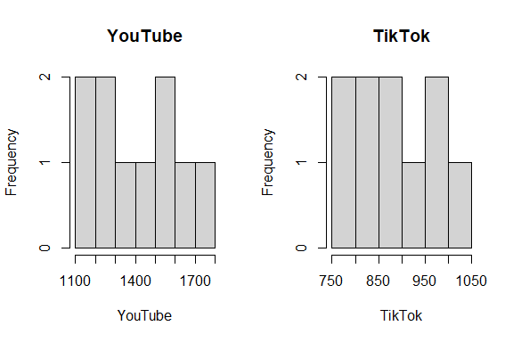<!-- -->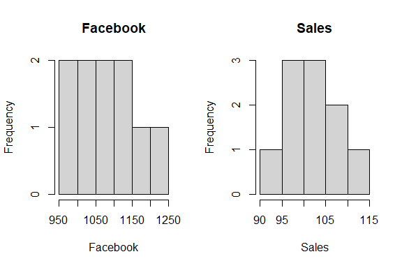<!-- -->

### **Box and Whisker Plot**


``` r
# `boxplot()` This is the function used to plot the box and whisker plot visualization
par(mfrow = c(1, 2))
for (i in 1:4) {
  if (is.numeric(advertising_data[[i]])) {
    boxplot(advertising_data[[i]], main = names(advertising_data)[i])
  } else {
    message(paste("Column", names(advertising_data)[i], "is not numeric and will be skipped."))
  }
}
```

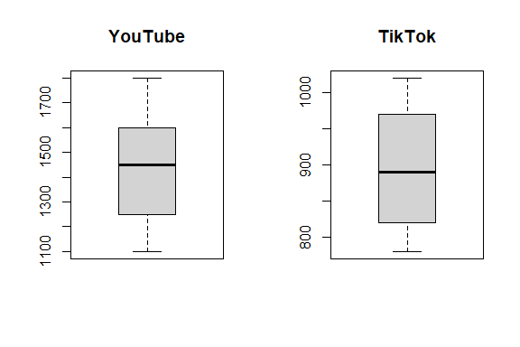<!-- -->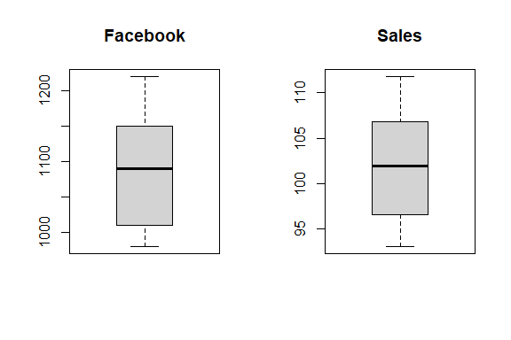<!-- -->

### **Missing Data Plot**


``` r
pacman::p_load("Amelia")

missmap(advertising_data, col = c("red", "grey"), legend = TRUE)
```

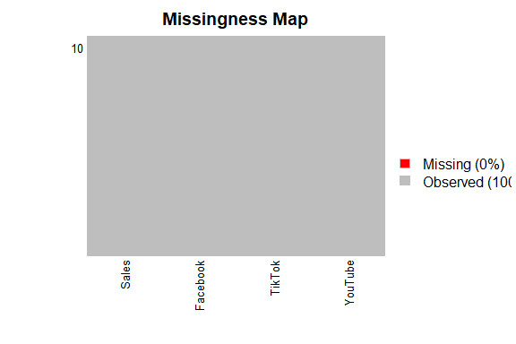<!-- -->

### **Correlation Plot**


``` r
pacman::p_load("ggcorrplot")

ggcorrplot(cor(advertising_data[,]))
```

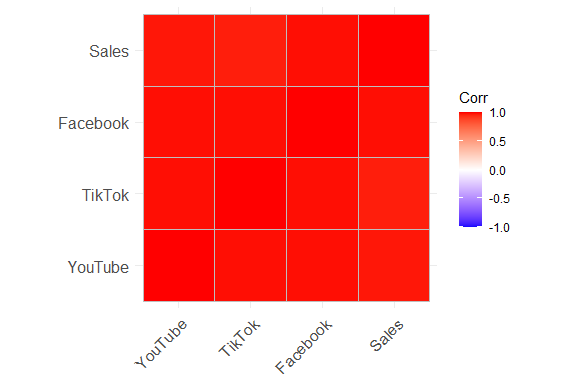<!-- -->

### **Scatter Plot**


``` r
pacman::p_load("corrplot")

pairs(advertising_data$Sales ~ ., data = advertising_data, col = advertising_data$Sales)
```

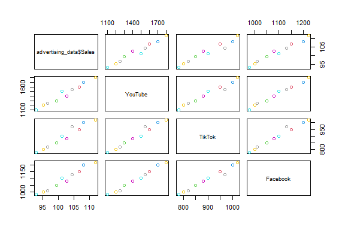<!-- -->


``` r
pacman::p_load("ggplot2")
ggplot(advertising_data,
       aes(x = YouTube, y = Sales)) + 
  geom_point() +
  geom_smooth(method = lm) +
  labs(
    title = "Relationship between Sales Revenue and \nExpenditure on YouTube Marketing",
    x = "Expenditure",
    y = "Sales"
  )
```

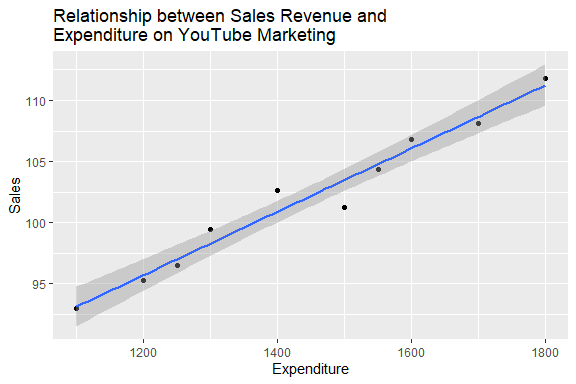<!-- -->


``` r
pacman::p_load("dplyr")
advertising_data_composite <- advertising_data %>%
  mutate(Total_Expenditure = YouTube + TikTok + Facebook)

ggplot(advertising_data_composite,
       aes(x = Total_Expenditure, y = Sales)) +
  geom_point() +
  geom_smooth(method = lm) +
  labs(
    title = "Relationship between Sales Revenue and \nTotal Marketing Expenditure",
    x = "Total Expenditure",
    y = "Sales"
  )
```

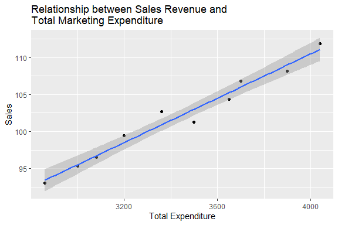<!-- -->

# Statistical Test

We then apply a simultaneous multiple linear regression as a statistical test for regression. The term "simultaneous" refers to how the predictor variables are entered and considered in the statistical test. It means that all the predictor variables included in the model are entered and evaluated at the same time.


View the summary of the model.


``` r
summary(mlr_test)
```

```
## 
## Call:
## lm(formula = Sales ~ YouTube + TikTok + Facebook, data = advertising_data)
## 
## Residuals:
##     Min      1Q  Median      3Q     Max 
## -1.5436 -0.6159  0.1056  0.6598  1.5978 
## 
## Coefficients:
##              Estimate Std. Error t value Pr(>|t|)
## (Intercept) 32.019096  24.432018   1.311    0.238
## YouTube      0.006088   0.015876   0.384    0.715
## TikTok      -0.007662   0.032263  -0.237    0.820
## Facebook     0.062289   0.048787   1.277    0.249
## 
## Residual standard error: 1.2 on 6 degrees of freedom
## Multiple R-squared:  0.9734,	Adjusted R-squared:  0.9602 
## F-statistic: 73.32 on 3 and 6 DF,  p-value: 4.055e-05
```

To obtain a 95% confidence interval:


``` r
confint(mlr_test, level = 0.95)
```

```
##                    2.5 %      97.5 %
## (Intercept) -27.76389745 91.80208927
## YouTube      -0.03275855  0.04493539
## TikTok       -0.08660653  0.07128263
## Facebook     -0.05708823  0.18166580
```

# Diagnostic EDA

Diagnostic EDA is performed to validate that the regression assumptions are true with respect to the statistical test. Validating the regression assumption in turn ensures that the statistical tests applied are appropriate for the data and helps to prevent incorrect conclusions.

## [**Test of Linearity**]{.underline}

The test of linearity is used to assess whether the relationship between the dependent variables and the independent variables is linear. This is necessary given that linearity is one of the key assumptions of statistical tests of regression and verifying it is crucial for ensuring the validity of the model's estimates and predictions.

A plot of the residuals versus the fitted values enables us to test for linearity. For the model to pass the test of linearity, there should be no pattern in the distribution of residuals and the residuals should be randomly placed around the 0.0 residual line, i.e., the residuals should randomly vary around the mean of the value of the response variable.


``` r
plot(mlr_test, which = 1)
```

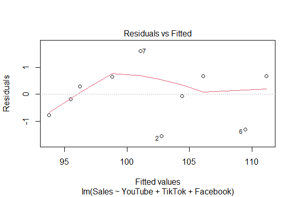<!-- -->

## [**Test of Independence of Errors**]{.underline}

This test is necessary to confirm that each observation is independent of the other. It helps to identify **autocorrelation** that is introduced when the data is collected over a close period of time or when one observation is related to another observation. Autocorrelation leads to underestimated standard errors and inflated t-statistics. It can also make findings appear more significant than they actually are.

The "**Durbin-Watson Test**" can be used as a test of independence of errors (test of autocorrelation).

-   The null hypothesis, H~0~, is that there is no autocorrelation

-   The alternative hypothesis, H~a~, is that there is autocorrelation

If the p-value is greater than 0.05 then there is no evidence to reject the null hypothesis that "there is no autocorrelation". The results below show a p-value of 0.5316, therefore, the test of independence of errors around the regression line passes.


``` r
pacman::p_load("lmtest")
dwtest(mlr_test)
```

```
## 
## 	Durbin-Watson test
## 
## data:  mlr_test
## DW = 2.1498, p-value = 0.5316
## alternative hypothesis: true autocorrelation is greater than 0
```

## [**Test of Normality**]{.underline}

The test of normality assesses whether the residuals are normally distributed, i.e., most residuals (errors) are close to zero and large errors are rare. A Q-Q plot can be used to conduct the test of normality.

A Q-Q plot is a scatterplot of the quantiles of the residuals against the quantiles of a normal distribution. Quantiles are statistical values that divide a dataset or probability distribution into equal-sized intervals. They help in understanding how data is distributed by marking specific points that separate the data into groups of equal size. Examples of quantiles include: quartiles (4 equal parts), percentiles (100 equal parts), deciles (10 equal parts), etc.

If the points in the Q-Q plot fall along a straight line, then the normality assumption is satisfied. If the points in the Q-Q plot do not fall along a straight line, then the normality assumption is not satisfied.


``` r
plot(mlr_test, which = 2)
```

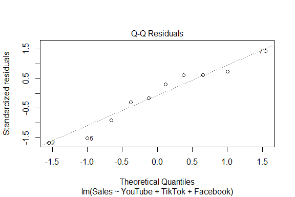<!-- -->

## [**Test of Homoscedasticity**]{.underline}

Homoscedasticity requires that the spread of residuals should be constant across all levels of the independent variable. A scale-location plot (a.k.a. spread-location plot) can be used to conduct a test of homoscedasticity.

The x-axis shows the fitted (predicted) values from the model and the y-axis shows the square root of the standardized residuals. The red line is added to help visualize any patterns.

In a model with homoscedastic errors (equal variance across all predicted values):

-   Points should be randomly scattered around a horizontal line

-   The smooth line should be approximately horizontal

-   The vertical spread of points should be roughly equal across all fitted values

-   No obvious patterns, funnels, or trends should be visible

Points forming a cone shape that widens from left to right suggests heteroscedasticity with increasing variance for larger fitted values.


``` r
plot(mlr_test, which = 3)
```

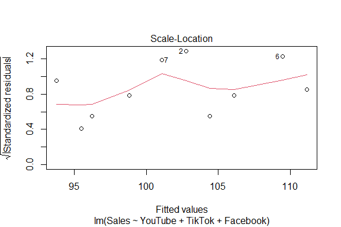<!-- -->

## [**Quantitative Validation of Assumptions**]{.underline}

The graphical representations of the various tests of assumptions should be accompanied by quantitative values. The `gvlma` package (Global Validation of Linear Models Assumptions) is useful for this purpose.


``` r
pacman::p_load("gvlma")
gvlma_results <- gvlma(mlr_test)
summary(gvlma_results)
```

```
## 
## Call:
## lm(formula = Sales ~ YouTube + TikTok + Facebook, data = advertising_data)
## 
## Residuals:
##     Min      1Q  Median      3Q     Max 
## -1.5436 -0.6159  0.1056  0.6598  1.5978 
## 
## Coefficients:
##              Estimate Std. Error t value Pr(>|t|)
## (Intercept) 32.019096  24.432018   1.311    0.238
## YouTube      0.006088   0.015876   0.384    0.715
## TikTok      -0.007662   0.032263  -0.237    0.820
## Facebook     0.062289   0.048787   1.277    0.249
## 
## Residual standard error: 1.2 on 6 degrees of freedom
## Multiple R-squared:  0.9734,	Adjusted R-squared:  0.9602 
## F-statistic: 73.32 on 3 and 6 DF,  p-value: 4.055e-05
## 
## 
## ASSESSMENT OF THE LINEAR MODEL ASSUMPTIONS
## USING THE GLOBAL TEST ON 4 DEGREES-OF-FREEDOM:
## Level of Significance =  0.05 
## 
## Call:
##  gvlma(x = mlr_test) 
## 
##                      Value p-value                Decision
## Global Stat        0.92304  0.9212 Assumptions acceptable.
## Skewness           0.04975  0.8235 Assumptions acceptable.
## Kurtosis           0.30420  0.5813 Assumptions acceptable.
## Link Function      0.41234  0.5208 Assumptions acceptable.
## Heteroscedasticity 0.15675  0.6922 Assumptions acceptable.
```

## Test of Multicollinearity

Multicollinearity arises when two or more independent variables (predictors) are highly intercorrelated. The **Variance Inflation Factor (VIF)** quantifies how much the variance of a coefficient estimate is “inflated” due to multicollinearity. A VIF of 1 indicates no collinearity; values above 5 suggest problematic levels of collinearity. High VIF values (VIF \> 5) suggest that the coefficient estimates are less reliable due to the correlations between predictors.


``` r
pacman::p_load("car")
vif(mlr_test)
```

```
##   YouTube    TikTok  Facebook 
##  82.13782  47.30912 103.46518
```

# Interpretation of the Results

## Academic Statement

A simultaneous multiple linear regression analysis was conducted on data from 10 observations (N=10) to examine whether advertising expenditures on YouTube, TikTok, and Facebook collectively predict Sales. The results indicated that neither expenses on YouTube ($\beta$ = 0.01, 95% CI [-.03, .04], SE = 0.02, *t*(6) = 0.38, *p* = .715), nor TikTok ($\beta$ = -0.01, 95% CI [-.09, .07], SE = 0.03, *t*(6) = -0.24, *p* = .820) nor Facebook ($\beta$ = 0.06, 95% CI [-.06, .18], SE = 0.05, *t*(6) = 1.28, *p* = .249) individually significantly predicted Sales (all *p* \> 0.05). The model explained 97.34% of the variance in Sales (Multiple R^2^ = .97, Adjusted R^2^ = .96, *F*(3, 6) = 73.32, *p* \< .001). The intercept was 32.02, 95% CI [-27.76, 91.80], SE = 24.43, *t*(6) = 1.31, *p* = .238. The residual standard error was 1.2, indicating a robust model. The full results are presented in the table below.

|  Predictor  | $\beta$ |     95% CI      |  SE   | *t*(6) | *p*  |
|:-----------:|:-------:|:---------------:|:-----:|:------:|:----:|
| (Intercept) |  32.02  | [-27.76, 91.80] | 24.43 |  1.31  | .238 |
|   YouTube   |  0.01   |   [-.03, .04]   | 0.02  |  0.38  | .715 |
|   TikTok    |  -0.01  |   [-.09, .07]   | 0.03  | -0.24  | .820 |
|  Facebook   |  0.06   |   [-.06, .18]   | 0.05  |  1.28  | .249 |

: Regression Coefficients Predicting Sales from Multiple Advertising Channels

***Note.*** N = 10; SE = standard error; CI = confidence interval.

Even though the results indicated a robust model whereby advertisement expenditures collectively predict sales, individual parameter estimates did not reach statistical significance when controlling for the other parameters. This suggests that the advertising channels collectively explain variation in Sales but do not uniquely predict Sales in this small sample. This may reflect multicollinearity among the different advertising platforms or limited statistical power due to the small sample size (*N* = 10). Future research should investigate these predictors with a larger sample and assess potential collinearity.

## Business Analysis

Although aggregate digital advertising spend across YouTube, TikTok, and Facebook is highly predictive of Sales (accounting for nearly all observed variation), the absence of statistically significant individual coefficients indicates that no single channel can be reliably credited with driving incremental Sales in this dataset. This finding suggests that, within the current investment levels and the constraints of a small sample, the three platforms function as a cohesive portfolio rather than as independent drivers of sales revenue. Recommendation for management:

1.  Continue to view YouTube, TikTok, and Facebook as complementary elements of a unified digital marketing strategy focusing on the total expenditure rather than favouring a single platform.

## Limitations

1.  Small Sample Size (N = 10): Using a limited number of observations restricts statistical power and inflates standard errors, raising the risk of a Type II error (failing to detect true channel effects).

2.  Potential Multicollinearity: High intercorrelations among YouTube, TikTok, and Facebook expenditures may obscure unique contributions.

3.  Restricted Expenditure Range: Limited range of advertisement expenditures impairs the ability to detect linear effects.

4.  Methodology: Lack of experimental variation in advertisement expenditure limits causal attribution to any single platform.
