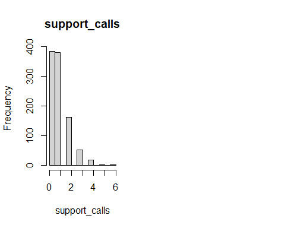
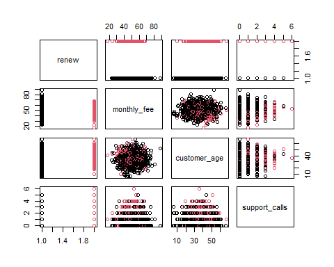

# Load the Dataset

The synthetic subscription churn dataset contains 1,000 observations and four variables:

1.  **monthly_fee:** The monthly subscription fee paid by the customer

2.  **customer_age:** The age of the customer in years.

3.  **support_calls:** The number of support calls the customer made in the last month

4.  **renew:** This is the outcome (dependent) variable (1 = customer will not cancel; 0 = customer will cancel)


``` r
pacman::p_load("readr")

subscription_churn_data <- 
  read_csv("data/subscription_churn.csv", col_types = cols(
    monthly_fee = col_double(),
    customer_age = col_double(),
    support_calls = col_integer(),
    renew = col_factor(levels = c("1", "0"))
    )
  )

head(subscription_churn_data)
```

```
## # A tibble: 6 × 4
##   monthly_fee customer_age support_calls renew
##         <dbl>        <dbl>         <int> <fct>
## 1        55.0         49               1 1    
## 2        48.6         44.2             0 1    
## 3        56.5         35.6             0 1    
## 4        65.2         28.5             2 1    
## 5        47.7         42               2 1    
## 6        47.7         38.9             0 1
```

# Initial EDA

[**View the Dimensions**]{.underline}

The number of observations and the number of variables.


``` r
dim(subscription_churn_data)
```

```
## [1] 1000    4
```

[**View the Data Types**]{.underline}


``` r
sapply(subscription_churn_data, class)
```

```
##   monthly_fee  customer_age support_calls         renew 
##     "numeric"     "numeric"     "integer"      "factor"
```


``` r
str(subscription_churn_data)
```

```
## spc_tbl_ [1,000 × 4] (S3: spec_tbl_df/tbl_df/tbl/data.frame)
##  $ monthly_fee  : num [1:1000] 55 48.6 56.5 65.2 47.7 ...
##  $ customer_age : num [1:1000] 49 44.2 35.6 28.5 42 38.9 44 41.4 45.5 29.6 ...
##  $ support_calls: int [1:1000] 1 0 0 2 2 0 2 0 0 1 ...
##  $ renew        : Factor w/ 2 levels "1","0": 1 1 1 1 1 1 1 1 1 1 ...
##  - attr(*, "spec")=
##   .. cols(
##   ..   monthly_fee = col_double(),
##   ..   customer_age = col_double(),
##   ..   support_calls = col_integer(),
##   ..   renew = col_factor(levels = c("1", "0"), ordered = FALSE, include_na = FALSE)
##   .. )
##  - attr(*, "problems")=<externalptr>
```

[**Descriptive Statistics**]{.underline}

## Measures of Frequency

79.4% continue their subscription and 20.6% cancelled their subscription. It is not balanced.


``` r
subscription_churn_data_freq <- subscription_churn_data$renew
cbind(frequency = table(subscription_churn_data_freq),
      percentage = prop.table(table(subscription_churn_data_freq)) * 100)
```

```
##   frequency percentage
## 1       794       79.4
## 0       206       20.6
```

## Measures of Central Tendency

The median and the mean of each numeric variable:


``` r
summary(subscription_churn_data)
```

```
##   monthly_fee     customer_age   support_calls   renew  
##  Min.   :17.59   Min.   : 5.60   Min.   :0.000   1:794  
##  1st Qu.:43.52   1st Qu.:28.90   1st Qu.:0.000   0:206  
##  Median :50.26   Median :35.60   Median :1.000          
##  Mean   :50.19   Mean   :35.71   Mean   :0.946          
##  3rd Qu.:56.48   3rd Qu.:42.30   3rd Qu.:1.000          
##  Max.   :88.53   Max.   :66.90   Max.   :6.000
```

## Measures of Distribution

Measuring the variability in the dataset is important because the amount of variability determines **how well you can generalize** results from the sample to a new observation in the population.

Low variability is ideal because it means that you can better predict information about the population based on the sample data. High variability means that the values are less consistent, thus making it harder to make predictions.

### Variance


``` r
sapply(subscription_churn_data[, 1:3], var)
```

```
##   monthly_fee  customer_age support_calls 
##    95.8872266    99.4621047     0.9680521
```

### Standard Deviation


``` r
sapply(subscription_churn_data[, 1:3], sd)
```

```
##   monthly_fee  customer_age support_calls 
##     9.7922023     9.9730690     0.9838964
```

### Kurtosis

The Kurtosis informs us of how often outliers occur in the results. There are different formulas for calculating kurtosis. Specifying “type = 2” allows us to use the 2nd formula which is the same kurtosis formula used in other statistical software like SPSS and SAS.

In “type = 2” (used in SPSS and SAS):

1.  Kurtosis \< 3 implies a low number of outliers

2.  Kurtosis = 3 implies a medium number of outliers

3.  Kurtosis \> 3 implies a high number of outliers


``` r
pacman::p_load("e1071")
sapply(subscription_churn_data[,],  kurtosis, type = 2)
```

```
##   monthly_fee  customer_age support_calls         renew 
##    0.07253817    0.05797590    1.47690531            NA
```

### Skewness

The skewness is used to identify the asymmetry of the distribution of results. Similar to kurtosis, there are several ways of computing the skewness.

Using “type = 2” (common in other statistical software like SPSS and SAS) can be interpreted as:

1.  Skewness between -0.4 and 0.4 (inclusive) implies that there is no skew in the distribution of results; the distribution of results is symmetrical; it is a normal distribution; a Gaussian distribution.

2.  Skewness above 0.4 implies a positive skew; a right-skewed distribution.

3.  Skewness below -0.4 implies a negative skew; a left-skewed distribution.


``` r
sapply(subscription_churn_data[,], skewness, type = 2)
```

```
##   monthly_fee  customer_age support_calls         renew 
##    0.11695309   -0.04915458    1.13818096            NA
```

## Measures of Relationship

### Covariance

Covariance is a statistical measure that indicates the direction of the linear relationship between two variables. It assesses whether increases in one variable correspond to increases or decreases in another.​

-   **Positive Covariance:** When one variable increases, the other tends to increase as well.

-   **Negative Covariance:** When one variable increases, the other tends to decrease.

-   **Zero Covariance:** No linear relationship exists between the variables.

While covariance indicates the direction of a relationship, it does not convey the strength or consistency of the relationship. The correlation coefficient is used to indicate the strength of the relationship.


``` r
cov(subscription_churn_data[,1:3], method = "spearman")
```

```
##               monthly_fee customer_age support_calls
## monthly_fee    83416.5906    -5314.774      692.4687
## customer_age   -5314.7743    83415.248    -1080.6076
## support_calls    692.4687    -1080.608    73676.7613
```

### Correlation

A strong correlation between variables enables us to better predict the value of the dependent variable using the value of the independent variable. However, a weak correlation between two variables does not help us to predict the value of the dependent variable from the value of the independent variable. This is useful only if there is a linear association between the variables.

We can measure the statistical significance of the correlation using Spearman's rank correlation *rho*. This shows us if the variables are significantly monotonically related. A monotonic relationship between two variables implies that as one variable increases, the other variable either consistently increases or consistently decreases. The key characteristic is the preservation of the direction of change, though the rate of change may vary.

To view the correlation of all variables at the same time


``` r
cor(subscription_churn_data[,1:3], method = "spearman")
```

```
##                monthly_fee customer_age support_calls
## monthly_fee    1.000000000  -0.06371415   0.008833009
## customer_age  -0.063714149   1.00000000  -0.013784151
## support_calls  0.008833009  -0.01378415   1.000000000
```

## Basic Visualizations

### Histogram


``` r
par(mfrow = c(1, 2))
for (i in 1:4) {
  if (is.numeric(subscription_churn_data[[i]])) {
    hist(subscription_churn_data[[i]],
         main = names(subscription_churn_data)[i],
         xlab = names(subscription_churn_data)[i])
  } else {
    message(paste("Column", names(subscription_churn_data)[i],
                  "is not numeric and will be skipped."))
  }
}
```

<!-- --><!-- -->

### Box and Whisker Plot


``` r
# `boxplot()` This is the function used to plot the box and whisker plot visualization
par(mfrow = c(1, 2))
for (i in 1:4) {
  if (is.numeric(subscription_churn_data[[i]])) {
    boxplot(subscription_churn_data[[i]], main = names(subscription_churn_data)[i])
  } else {
    message(paste("Column", names(subscription_churn_data)[i],
                  "is not numeric and will be skipped."))
  }
}
```

<!-- --><!-- -->

### Missing Data Plot


``` r
pacman::p_load("Amelia")

missmap(subscription_churn_data, col = c("red", "grey"), legend = TRUE)
```

<!-- -->

### Correlation Plot


``` r
pacman::p_load("ggcorrplot")

ggcorrplot(cor(subscription_churn_data[,1:3]))
```

<!-- -->

### Scatter Plot


``` r
pacman::p_load("corrplot")

pairs(renew ~ ., data = subscription_churn_data, col = subscription_churn_data$renew)
```

<!-- -->


``` r
pacman::p_load("ggplot2")
ggplot(subscription_churn_data,
       aes(x = customer_age, y = monthly_fee)) + 
  geom_point() +
  geom_smooth(method = lm) +
  labs(
    title = "Relationship between Monthly Fee and \nCustomer Age",
    x = "Customer Age",
    y = "Monthly Fee"
  )
```

<!-- -->


``` r
pacman::p_load("ggplot2")
ggplot(subscription_churn_data,
       aes(x = customer_age, y = monthly_fee, color = renew)) + 
  geom_point() +
  geom_smooth(method = lm) +
  labs(
    title = "Relationship between Monthly Fee and \nCustomer Age for Each Renewal Status",
    x = "Customer Age",
    y = "Monthly Fee",
    color = "Renewal Status"
  ) +
  scale_color_discrete(
    labels = c("1" = "Renewed Subscription", "0" = "Cancelled Subscription")
  ) + 
  theme_minimal()  # Optional: adds a cleaner theme
```

<!-- -->

# Statistical Test

We then apply a logistic regression as a statistical test for regression.


View the summary of the model.


``` r
summary(log_test)
```

```
## 
## Call:
## glm(formula = renew ~ monthly_fee + customer_age + support_calls, 
##     family = binomial, data = subscription_churn_data)
## 
## Coefficients:
##                Estimate Std. Error z value Pr(>|z|)    
## (Intercept)   -0.941778   0.545980  -1.725  0.08454 .  
## monthly_fee   -0.043563   0.008934  -4.876 1.08e-06 ***
## customer_age   0.026110   0.008451   3.089  0.00201 ** 
## support_calls  0.697795   0.081536   8.558  < 2e-16 ***
## ---
## Signif. codes:  0 '***' 0.001 '**' 0.01 '*' 0.05 '.' 0.1 ' ' 1
## 
## (Dispersion parameter for binomial family taken to be 1)
## 
##     Null deviance: 1017.22  on 999  degrees of freedom
## Residual deviance:  906.19  on 996  degrees of freedom
## AIC: 914.19
## 
## Number of Fisher Scoring iterations: 4
```

## p-Value of the $\chi^2$ Statistic

To obtain the p-value of the $\chi^2$ statistic:


``` r
# chi_2 <- log_test$null.deviance/1 - log_test$residuals
chi_2 <- 1017.22 - 906.19

print(chi_2)
```

```
## [1] 111.03
```

``` r
p <- 1 - pchisq(chi_2, df = 3)
# to format as a scientific notation with four digits after the decimal place
# sprintf("%.4e", p)
format.pval(p, eps = .Machine$double.eps, digits = 2)
```

```
## [1] "<2e-16"
```

## 95% Confidence Interval of the Parameters

To obtain a 95% confidence interval for the parameters:


``` r
confint(log_test, level = 0.95)
```

```
##                      2.5 %      97.5 %
## (Intercept)   -2.018238039  0.12436807
## monthly_fee   -0.061306856 -0.02624538
## customer_age   0.009645052  0.04281132
## support_calls  0.540327294  0.86041171
```

## Odds Ratio

Exponentiating the coefficients yields odds ratios, which quantify the multiplicative change in odds for a one‑unit increase in the predictor.


``` r
exp(coef(log_test))
```

```
##   (Intercept)   monthly_fee  customer_age support_calls 
##     0.3899341     0.9573725     1.0264536     2.0093179
```

### 95% Confidence Interval for the Odds Ratio

To obtain a 95% confidence interval for the Odds Ratio:


``` r
pacman::p_load("dplyr")
confint(log_test) %>% exp()
```

```
##                   2.5 %   97.5 %
## (Intercept)   0.1328894 1.132433
## monthly_fee   0.9405346 0.974096
## customer_age  1.0096917 1.043741
## support_calls 1.7165686 2.364134
```

## Akaike Information Criterion (AIC)

AIC specifies how well a model fits the data from which it was generated. The AIC value is calculated using the number of predictor variables and also the estimate of the maximum likelihood of the model. AIC penalizes complexity, therefore, any model with a lesser AIC value is a more significant model. A lower AIC value means the complexity of the model is lower and the model better explains the variations. The model's AIC value of 914.19 can be compared with the AIC value of alternative models, e.g., a logistic regression that has dropped one of the original predictors.

## McFadden’s Pseudo R^2^

Logistic regression does not use the traditional R², but we can compute a **pseudo-R²** (McFadden’s) as follows:


``` r
pseudo_r2 <- 1 - (log_test$deviance / log_test$null.deviance)
print(pseudo_r2)
```

```
## [1] 0.1091487
```

A McFadden's pseudo-R^2^ of 0.109 suggests that the predictors explain approximately 10.91% of the variance in the outcome. pseudo-R^2^ \> 0.2 are considered strong in logistic regression.

## Fisher Scoring Iterations

There were 4 Fisher scoring iterations which indicates that the fitting routine required four iterative updates to reach convergence. A small number (\< 10) suggests that the algorithm found the maximum-likelihood estimates efficiently without convergence warnings.

## Model Fit Metrics

The ROC Curve and the AUC gives insight into how well the logistic regression model distinguishes between the two outcome classes (1 = renew and 0 = cancel).

-   The x-axis shows the False Positive Rate (FPR), or specificity.

-   The y-axis shows the True Positive Rate (TPR), or sensitivity.

-   The curve shows how TPR and FPR change as the decision threshold changes from 0 to 1.

-   A curve closer to the top-left corner indicates better model performance.


``` r
pacman::p_load("pROC")

predicted_probs <- predict(log_test, type = "response")

roc_obj <- roc(subscription_churn_data$renew, predicted_probs)
auc_value <- auc(roc_obj)
plot(roc_obj, col = "blue", main = "ROC Curve for Logistic Regression")
```

<!-- -->


``` r
print(auc_value)
```

```
## Area under the curve: 0.7167
```

| AUC Value | Interpretation |
|------------------------------------|------------------------------------|
| 0.5 | Using the logistic regression model is equivalent to randomly guessing |
| 0.6 - 0.7 | Poor discrimination of the classes |
| 0.7 - 0.8 | Acceptable discrimination of the classes (fair) |
| 0.8 - 0.9 | Good discrimination |
| 0.9 - 1.0 | Excellent discrimination |

: AUC Value Interpretation

With an AUC of 0.7167 indicates that the model has an acceptable ability to discriminate between the two classes.

# Diagnostic EDA

Diagnostic EDA is performed to validate that the regression assumptions are true with respect to the statistical test. Validating the regression assumption in turn ensures that the statistical tests applied are appropriate for the data and helps to prevent incorrect conclusions.

## Test of Linearity

The test of linearity is necessary given that linearity is one of the key assumptions of statistical tests of regression and verifying it is crucial for ensuring the validity of the model's estimates and predictions.

**Component-Plus-Residual (Partial-Residual) Plots**

Logistic regression assumes that the relationship between the logit (log-odds) of the outcome and the continuous predictors is linear. A logit is the natural logarithm of the odds of an event occurring, i.e., if *p* is the probability of an event (where 0 \< *p* \< 1), the odds are $\frac{p}{1 - p}$ and the logit is:

$$ \text{logit}(p) = \ln\left(\frac{p}{1-p}\right) $$

A roughly straight line indicates the logit-predictor linearity assumption is met.


``` r
pacman::p_load("car")

crPlots(log_test)
```

<!-- -->

## Test of Independence of Errors

This test is necessary to confirm that each observation is independent of the other. It helps to identify **autocorrelation** that is introduced when the data is collected over a close period of time or when one observation is related to another observation. Autocorrelation leads to underestimated standard errors and inflated t-statistics. It can also make findings appear more significant than they actually are.

The "**Durbin-Watson Test**" can be used as a test of independence of errors (test of autocorrelation).

-   The null hypothesis, H~0~, is that there is no autocorrelation

-   The alternative hypothesis, H~a~, is that there is autocorrelation

If the p-value is greater than 0.05 then there is no evidence to reject the null hypothesis that "there is no autocorrelation". The results below show *p* \> 0.05, therefore, the test of independence of errors around the regression line passes.


``` r
pacman::p_load("lmtest")
dwtest(log_test)
```

```
## 
## 	Durbin-Watson test
## 
## data:  log_test
## DW = 2.0912, p-value = 0.9258
## alternative hypothesis: true autocorrelation is greater than 0
```

## Test of Normality

Logistic regression does not assume normality of residuals or predictors.

## Test of Homoscedasticity

The test of homoscedasticity is not relevant for logistic regression.

## Test of Multicollinearity

Multicollinearity arises when two or more independent variables (predictors) are highly intercorrelated. The **Variance Inflation Factor (VIF)** quantifies how much the variance of a coefficient estimate is “inflated” due to multicollinearity. A VIF of 1 indicates no collinearity; values above 5 suggest problematic levels of collinearity. High VIF values (VIF \> 5) suggest that the coefficient estimates are less reliable due to the correlations between predictors.


``` r
pacman::p_load("car")
vif(log_test)
```

```
##   monthly_fee  customer_age support_calls 
##      1.017865      1.003913      1.020388
```

## Test of Outliers

The `influencePlot()` function in R combines 3 key diagnostic measures in to a single plot to identify influential observations.

The plot displays:

-   Y-axis: Studentized residuals (standardized residuals adjusted for leverage).

-   X-axis: Leverage (hat values), measuring how "unusual" an observation is in terms of its predictor values.

-   Bubble size: Cook’s distance, quantifying the influence of each observation on the model coefficients.

Top-left/bottom-left:

-   Indicates observations with high residuals but low leverage: Outliers in the outcome but not predictors.

-   Possible next step: Investigate the observations for misclassified outcomes.

Top-right/bottom-right:

-   Indicates high residuals and high leverage: Influential outliers that distort the model.

-   Possible next step: These are the most problematic observations. You need to check if they are valid data points or errors.

Middle-right:

-   High leverage but residuals near 0: Unusual predictor values but well-predicted outcomes.

-   Possible next step: These observations are generally safe to keep.


``` r
pacman::p_load("car")

influencePlot(log_test, 
              id = list(n = 5),  # Label top 5 influential points
              main = "Influence Plot",
              sub = "Circle size = Cook's Distance")
```

<!-- -->

```
##        StudRes         Hat       CookD
## 66   2.5131733 0.002206220 0.012165628
## 92   2.3329288 0.001942625 0.006822822
## 184  2.4100283 0.002433914 0.010319622
## 263  1.1669909 0.020141623 0.005015865
## 294 -1.6986014 0.019738247 0.015927999
## 347  2.1803805 0.007365365 0.017572966
## 437 -1.1050303 0.018518805 0.003975203
## 489  1.4311225 0.021496490 0.009721397
## 592 -0.9163872 0.021272184 0.002849801
## 631 -1.8366802 0.012990570 0.014176667
## 708  2.2742892 0.005166374 0.015498587
## 864  2.3828386 0.003736612 0.014686885
## 894  2.3758317 0.002043544 0.007976687
```

The influential outliers can then be:

1.  Corrected for data entry errors, e.g., an age of 240 years

2.  Deleted so that the statistical test can be run again without them


Print the observation numbers that have been identified as influential outliers


``` r
print(influential_points)
```

```
## [1]  66 184 294 347 489 592
```

Print the influential observations' predictor and outcome values.


``` r
head(subscription_churn_data_infl)
```

```
## # A tibble: 6 × 4
##   monthly_fee customer_age support_calls renew
##         <dbl>        <dbl>         <int> <fct>
## 1        63.6         23.8             0 0    
## 2        54.8         19.3             0 0    
## 3        58.5         43.4             5 1    
## 4        35.5          9.5             0 0    
## 5        66.9         19.7             4 0    
## 6        45.2          5.8             3 1
```

# Interpretation of the Results

## Academic Statement

A logistic regression analysis was conducted on data (N = 1,000) to examine whether monthly subscription fee paid by a customer, the customer's age, and the number of support calls the customer made in the last month predicted the subscription renewal, where renew was coded 1 for subscription renewal and 0 for subscription cancellation.

Subtracting the residual deviance (906.19 on 996 df) from the null deviance (1,017.22 on 999 df) gave a $\chi^2$(3, N = 1,000) = 111.03, *p* \< .001, thus showing that the model was statistically significant compared to the null model. The set of predictors reliably distinguished between renewals and cancellations.

The results are reported in the table below:

|        Predictor        | $\beta$ |     95% CI     |  SE  |  *z*  |   *p*   |
|:-----------------------:|:-------:|:--------------:|:----:|:-----:|:-------:|
|       (Intercept)       |  -0.94  | [-2.02, 0.12]  | 0.55 | -1.73 |  0.085  |
|       Monthly Fee       |  -0.04  | [-0.06, -0.03] | 0.01 | -4.88 | \< .001 |
|     Customer's Age      |  0.03   |  [0.01, 0.04]  | 0.01 | 3.09  |  .002   |
| Number of Support Calls |  0.70   |  [0.54, 0.86]  | 0.08 | 8.56  | \< .001 |

: Regression Coefficients Predicting Renewal from Multiple Customer Features

***Note.*** N = 1,000; SE = standard error; CI = confidence interval.

**Predictor Effects**

-   The monthly fee ($\beta$ = -0.04, 95% CI [-0.06, -0.03], SE = 0.01, *z* = -4.88, *p* \< .001) was the first predictor. For every unit increase in monthly fees, the odds of renewal decrease by 4% (*OR* = 0.96, 95% CI [0.94, 0.97], p\< .001).

-   The customer age ($\beta$ = 0.03, 95% CI [0.01, 0.04], SE = 0.01, *z* = 3.09, *p* = .002). For every unit increase in the customer's age, the odds of renewal increased by 3% (*OR* = 1.03, 95% CI [1.01, 1.04], *p* = .002).

-   The number of support calls ($\beta$ = 0.70, 95% CI [0.54, 0.86], SE = 0.08, *z* = 8.56, *p* \< .001). For every unit increase in the number of support calls, the odds of renewal increased by 101% (*OR* = 2.01, 95% CI [1.72, 2.36], *p* \< .001)

-   The intercept term was not statistically significant ($\beta$ = -0.94, 95 % CI [-2.02, 0.12], SE = 0.55, *z* = -1.73, *p* = 0.085) thus indicating no significant baseline odds of renewal when all predictors are zero.

## Business Analysis

Key insights:

1.  Monthly Fee:

    -   Finding: Higher monthly fees significantly reduce renewal odds (−4% per unit increase in monthly fee).

    -   Implication: Customers are price-sensitive; fee hikes risk cancellations.

    -   Recommendation: Avoid aggressive fee increases. Consider small, incremental fee adjustments for high-value customers.

2.  Customer Age:

    -   Finding: Older customers are more likely to renew (+3% odds per year of age).

    -   Implication: Younger customers may need targeted retention efforts.

    -   Recommendation: Launch engagement campaigns, e.g., personalized offers

3.  Support Calls:

    -   Finding: Each support call doubles renewal odds (+101% per unit increase in support calls).

    -   Implication: Proactive customer support drives loyalty and retention.

    -   Recommendations:

        -   Train customer care officers to resolve issues fully and to anticipate needs, e.g., follow-up calls after ticket closure

        -   Avoid over-reliance on support calls: High call volumes may indicate unresolved product issues.

## Limitations

1.  Logistic regression performs poorly with small datasets or rare events (e.g., very few cancellations). Renewal rates are imbalanced, 79.4% renewals, therefore, the coefficient estimates could be biased.

2.  Assumes no clustering (e.g., multiple subscriptions per customer) or autocorrelation (e.g., time-series trends).

3.  Stakeholders may struggle to interpret deviance or AIC values.

4.  Support Call Paradox: While `support_calls` had a strong positive effect, excessive calls could signal dissatisfaction (which is not captured by the model).
